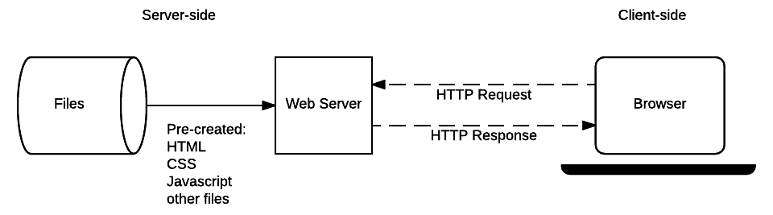

# Web Server & User Architecture

<kbd></kbd>

## 1️⃣ Code  

Code is a set of instructions written in programming languages (like Java, Python, or JavaScript). It runs on servers or browsers to process requests and give responses.  

## 2️⃣ Web Server  

A **Web Server** handles user requests and sends responses (like web pages or API data). Examples:  

- **Apache, NGINX** (Serve web pages)  
- **Node.js (Express), Django, Flask** (Run application logic)  

## 3️⃣ User  

A **User** interacts with a website or app through a browser or mobile app. Users send requests and get responses from the web server.  

## 🔄 How It Works  

1. A **User** requests a webpage (e.g., `www.example.com`).  
2. The **Web Server** processes it using the **Code**.  
3. The server sends a response, displaying the page or data.  

## 🚀 Simple Example  

- You search for something on Google.  
- Google’s servers find the data and send it back.  
- You see the results in your browser.
