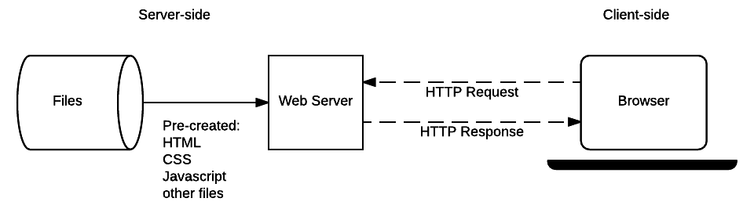
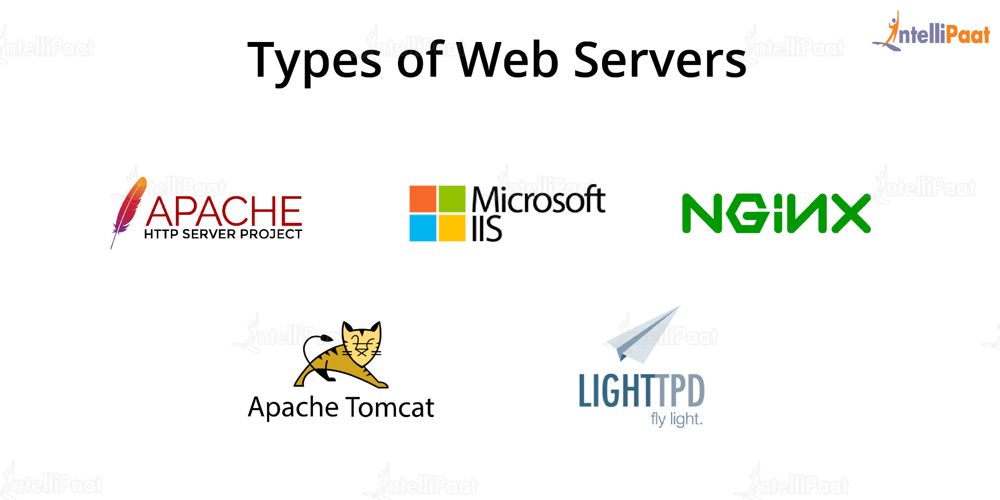
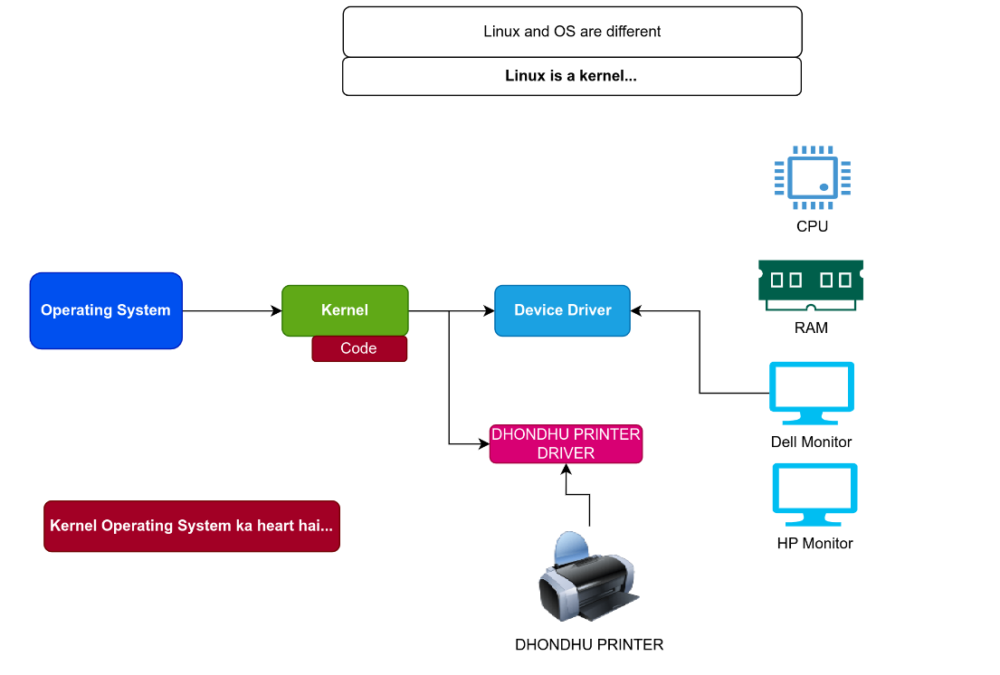
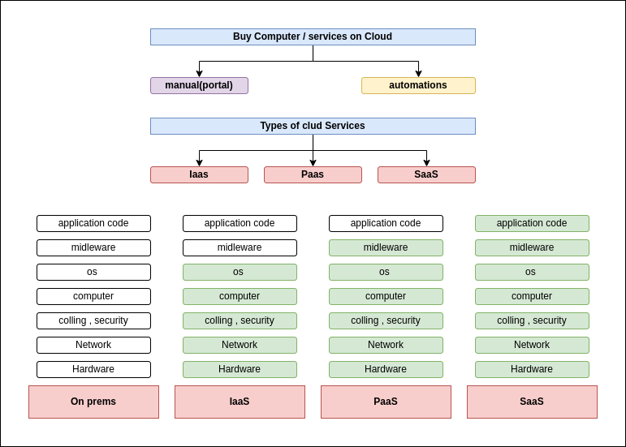

# Web server & user
<kbd></kbd>

# Web server
<kbd></kbd>

# Three-Tier Applications
<kbd></kbd>

# Linux
<kbd></kbd>

# Linux file system
<kbd></kbd>

# Deploy ccd clone on nginx
<kbd></kbd>

# On-Premise vs cloud
<kbd></kbd>

# On-Premise , cloud computer
<kbd></kbd>

# cloud types
<kbd></kbd>

# Automation
<kbd></kbd>