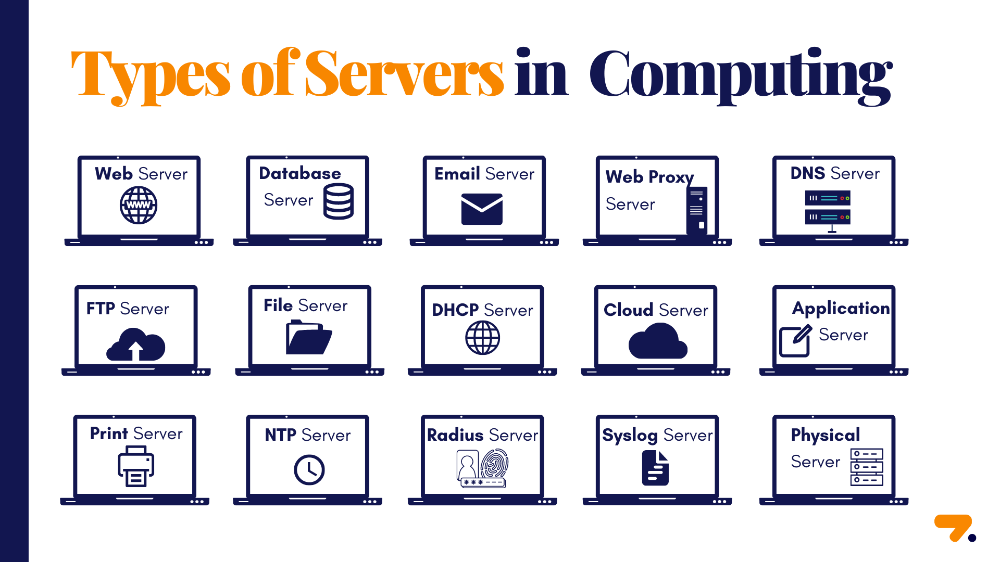

# Web Server

<kbd></kbd>

<kbd></kbd>

## Common Web Server Software

- **Apache**: A widely used open-source web server.
- **Nginx**: A high-performance web server and reverse proxy.
- **Tomcat**: A Java-based web server for running Java Servlets and JSPs.
- **IIS (Internet Information Services)**: A web server developed by Microsoft.

## General Terms

- **Web Server**: A software that handles HTTP requests and serves web pages or applications. Examples: Apache, Nginx, Tomcat.
- **Client**: A device or application (e.g., browser) that requests resources from a web server.
- **Request**: A message sent by the client to the server asking for a resource (e.g., a webpage).
- **Response**: The server's reply to a request, usually containing an HTML page, JSON data, or an error message.

## HTTP & Networking Terms

- **HTTP (HyperText Transfer Protocol)**: A protocol used for communication between a client and a web server.
- **HTTPS (HTTP Secure)**: A secure version of HTTP that uses SSL/TLS encryption.
- **TCP/IP (Transmission Control Protocol/Internet Protocol)**: The fundamental communication protocols for data exchange over networks.
- **Port**: A communication endpoint. Common web server ports:
  - `80` (HTTP)
  - `443` (HTTPS)
  - `8080` (Alternative for HTTP)
- **DNS (Domain Name System)**: Translates domain names (e.g., `example.com`) into IP addresses.
- **Load Balancer**: Distributes incoming network traffic across multiple servers for scalability and reliability.

## Web Server Components

- **Virtual Host**: A configuration allowing multiple domains to be hosted on the same web server.
- **Reverse Proxy**: A server that forwards client requests to backend servers. Example: Nginx as a reverse proxy.
- **Cache**: A temporary storage for frequently accessed data to improve performance.

## Server-Side Terms

- **Middleware**: Software that connects different applications or services in a web stack.
- **Session**: A way to store user data across multiple requests.
- **Cookie**: A small piece of data stored in the user's browser to track sessions and preferences.
